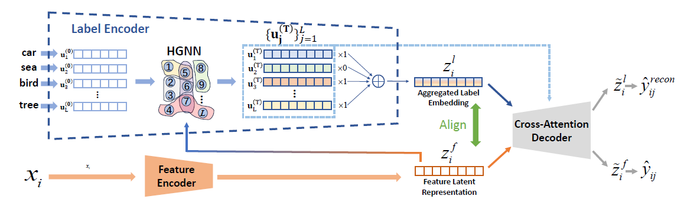

# HyperLabel: Multi-Label Classification via Hypergraph-Based Label Correlation Modeling

PyTorch implementation of **HyperLabel: Multi-Label Classification via Hypergraph-Based Label Correlation Modeling**

---



## ⚙️ Environment Setup

### 🐳 Option 1: Docker (Recommended)

```bash
# Build image
docker build -t hyperlabel:latest .

# Run container
docker run -it --gpus all -v $(pwd):/opt/app hyperlabel:latest /bin/bash
```

### 🧩 Option 2: Conda
```
conda create -n hyperlabel python=3.10
conda activate hyperlabel
pip install -r requirements.txt
```


### 📦 Dataset

Download datasets
```
wget https://www.cs.virginia.edu/yanjun/jack/lamp_datasets.tar.gz
tar -xvf lamp_datasets.tar.gz -C ./data/
```


## 🚀 Train & Evaluate
```
bash ./scripts/train_reuters.sh

bash ./scripts/train_sider.sh
```
